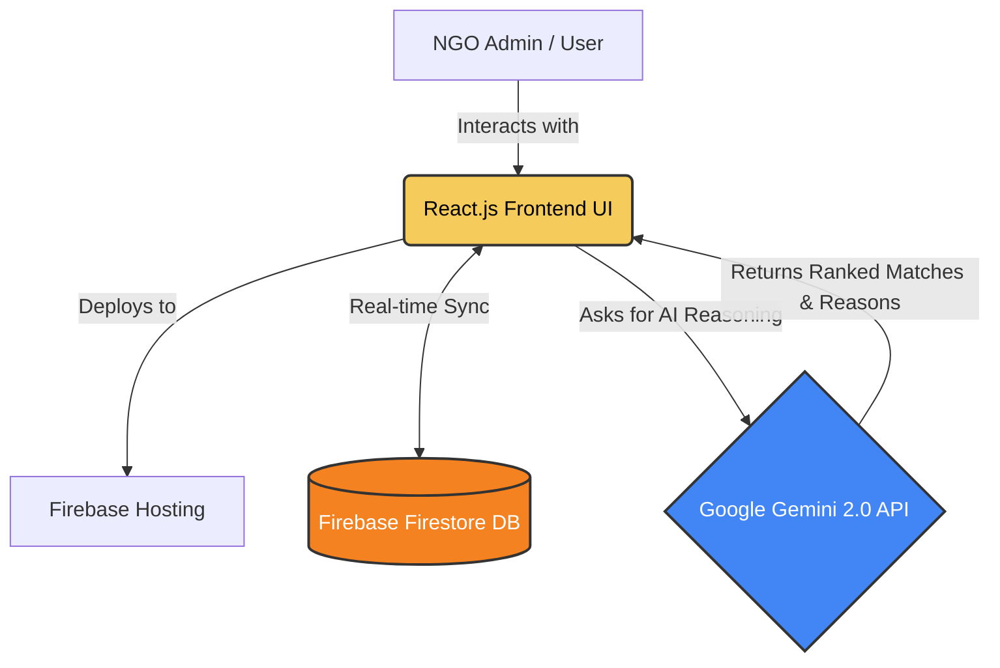
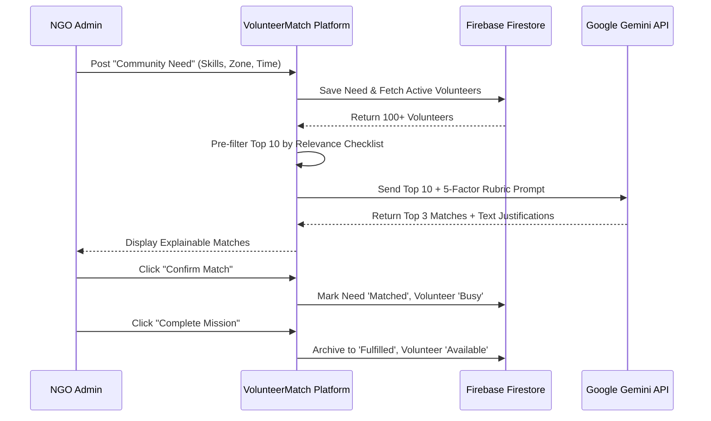

# VolunteerMatch AI 🤝

> **Empowering NGO coordinators with Explainable AI Dispatch for rapid disaster relief and community coordination.**

[](https://volunteer-matcherai.web.app)
[](https://developers.google.com/community/gdsc-solution-challenge)
[](https://ai.google.dev/)

VolunteerMatch AI is a next-generation resource allocation platform built for the **Hack2Skill × Google for Developers — Solution Challenge 2026**. It transforms how NGOs respond to critical emergencies by replacing manual, spreadsheet-based coordination with an autonomous, **deterministic AI matching engine**.

---

## 🛑 The Problem: "The Coordination Crisis"
During critical emergencies—such as floods, earthquakes, or civil crises—local social groups struggle with siloed, fragmented data.
- **Data Silos:** Community needs are captured on paper or in scattered WhatsApp messages.
- **Manual Bottlenecks:** NGO admins spend hours manually reading profiles to match volunteers to tasks.
- **High Stakes:** Every minute wasted on logistics translates directly to **lives lost**.

## 💡 Our Solution: "Explainable AI Dispatch"
**VolunteerMatch AI** centralizes disaster response into a single, real-time dashboard. By integrating **Google Gemini 2.0 Flash Lite**, we automate the cognitive reasoning process, allowing admins to dispatch the right personnel to the right location in seconds.

### The "Wow" Factor: Explainable AI
Unlike a "black-box" algorithm, our system provides human-readable justifications for every match. NGO workers maintain absolute trust and final control over every life-saving deployment.

---

## 🛠️ Technical Architecture

VolunteerMatch AI follows a modern, real-time architecture designed for speed and reliability in high-pressure scenarios.



### Process Flow: Need-to-Deployment Lifecycle



---

## 🧠 The AI Matching Engine: 5-Factor Rubric

Our matching engine isn't just a search; it's a reasoning system. Gemini evaluates every candidate against a strict **5-factor heuristic rubric**:

1.  **Skills Overlap (40%)**: Calculated ratio of volunteer skills matching the need's requirements.
2.  **Zone Proximity (20%)**: Leverages a zone-adjacency map to prefer local or neighboring personnel.
3.  **Schedule Intelligence (20%)**: Native understanding of time (e.g., matching "Weekend Needs" only to "Weekend-available" volunteers).
4.  **Skill Depth (10%)**: Rewards versatile volunteers with additional relevant capabilities.
5.  **Specialization Bonus (10%)**: Extra points for high-impact skills (Medical, Triage, Rescue, Ham Radio, Drones).

---

## ✨ Key Features
- **Live Disaster Map:** Real-time geographic visualization of urgent needs and volunteer distribution.
- **Operational Analytics:** Live charts tracking crisis zones and deployment efficiency using **Recharts**.
- **Dynamic Resource Balancing:** Matched volunteers are set to 'Busy' automatically to prevent double-booking.
- **Mission Control:** A dedicated lifecycle view for tracking "En Route" volunteers and mission fulfillment.
- **Real-time Sync:** Powered by **Firebase Firestore**, ensuring all admins see updates instantly.
- **Glassmorphism UI:** A premium, modern interface built with **Tailwind CSS** and **Framer Motion**.

---

## 🚀 Technologies Used
- **Frontend Core:** React 18, Vite
- **AI Integration:** Google Gemini 2.0 Flash Lite API
- **Database & Sync:** Firebase Firestore (NoSQL)
- **Deployment:** Firebase Hosting
- **Styling:** Tailwind CSS, Framer Motion (Animations)
- **Visualization:** React-Leaflet (Maps), Recharts (Charts)
- **Icons:** Lucide React

---

## 💻 Local Development

To run the prototype on your machine:

1.  **Clone the Repo:**
    ```bash
    git clone https://github.com/your-repo/vol-matcher-ai.git
    cd vol-matcher-ai
    ```
2.  **Install Dependencies:**
    ```bash
    npm install
    ```
3.  **Configure Environment:**
    Create a `.env` file in the root:
    ```env
    VITE_GEMINI_API_KEY=your_google_ai_studio_api_key
    ```
4.  **Start Dev Server:**
    ```bash
    npm run dev
    ```
5.  **Configuration Fallback:**
    If you don't have an API key handy, click the **Sparkles Settings Icon** in the bottom-right corner of the dashboard to input it directly in the browser!

---

## 🗺️ Roadmap: The Future of VolunteerMatch AI
- **Multi-modal Damage Assessment:** Use **Gemini Vision** to analyze disaster zone photos and auto-extract skill requirements.
- **Omni-channel Dispatch:** Automated SMS/WhatsApp notifications for volunteers via Twilio integration.
- **Offline-First PWA:** Critical for field workers in areas with unstable internet connectivity.
- **Global Zone Mapping:** Expanding the adjacency engine to support international NDMA zones.

---
*Built with ❤️ for the Solution Challenge 2026.*

