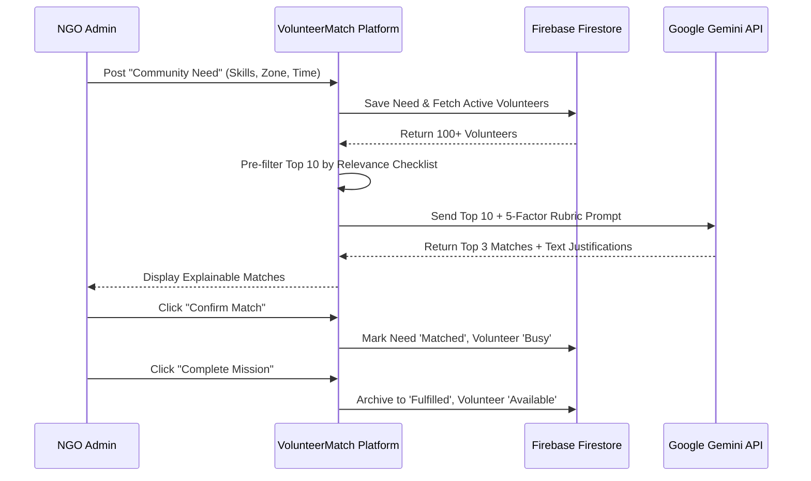
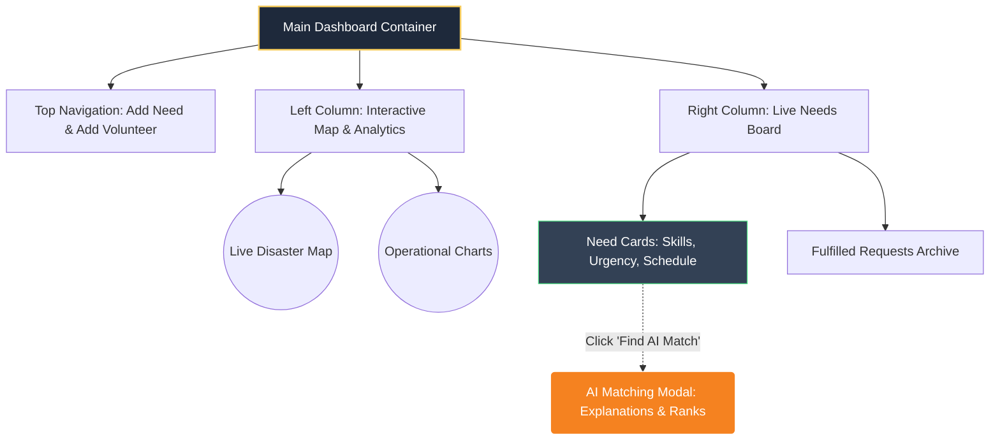
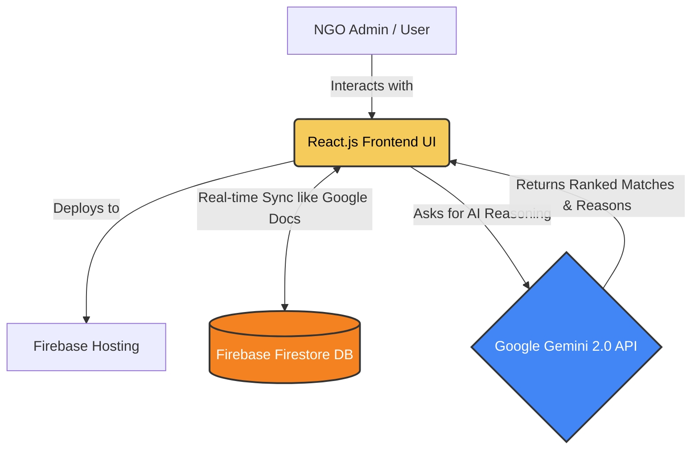

# VolunteerMatch AI - Solution Challenge 2026 Presentation Content

> **Instructions for the User:** 
> Copy and paste the text below into the respective slides of your `[EXT] Solution Challenge 2026 - Prototype PPT Template` file. Replace bracketed placeholders like `[Your Team Name]` with your actual details. 
> 
> *Tip: For the diagrams, you can render the provided Mermaid code blocks in a tool like [Mermaid Live Editor](https://mermaid.live/), take a screenshot, and paste it into the presentation.*

---

## Slide 1: Team Details
**a. Team name:** [Your Team Name / e.g. Snack-Overflow]
**b. Team leader name:** [Your Name / Vyom]
**c. Problem Statement:** 
During critical emergencies (floods, earthquakes, crises), local NGOs and social groups struggle with siloed, spreadsheet-based volunteer coordination. Every minute wasted manually matching the right person to the right need costs lives. There is no centralized, intelligent system to instantly correlate geographic data, volunteer skills, and urgent community needs at scale.

---

## Slide 2: Brief about your solution
**VolunteerMatch AI** is a next-generation, AI-driven resource allocation platform built for disaster relief. By integrating Google's Gemini 2.0 Flash Lite API, our system replaces manual coordination with an autonomous, **deterministic matching engine** *(meaning it follows strict, predictable rules rather than guessing)*. It intelligently evaluates volunteer skills, geographic proximity (NDMA/NDRF zones), and schedule compatibility to instantly dispatch the perfect personnel to critical needs, complete with human-readable, **explainable AI** justifications *(the AI tells you exactly why it chose someone)*.

---

## Slide 3: Opportunities
**a. How different is it from any of the other existing ideas?**
Traditional systems rely on static bulletin boards or rigid database filters that lack contextual awareness. VolunteerMatch AI understands complex correlations (e.g., matching a weekend-available trauma counselor in an adjacent zone to a critical medical need) and automates the cognitive reasoning process natively.

**b. How will it be able to solve the problem?**
By centralizing all requests and utilizing a strict **5-factor AI heuristic** *(a 5-step checklist the AI uses to grade matches: Skills, Zone, Availability, Skill Depth, Specialization)*, we reduce volunteer deployment decision times from hours to seconds.

**c. USP of the proposed solution**
**"Explainable AI Dispatch"** – Our system doesn't just provide a black-box score or a magic number. Gemini generates a natural-language justification for every deployment. This means NGO admins have full transparency and absolute trust in the AI's decision-making before confirming a life-saving match.

---

## Slide 4: List of features offered by the solution
* **Live Disaster Map:** Real-time geographic visualization of urgent needs and active/busy volunteers.
* **Explainable AI Matching Engine:** AI scoring that comes with human-readable match justifications so humans remain in control.
* **Schedule & Availability Intelligence:** The AI natively handles time-based logic, ensuring a "Weekday Need" isn't assigned to a "Weekend-only Volunteer".
* **Mission Control & Deployment Tracking:** Real-time lifecycle management (En Route ➔ Fulfilled) with dynamic resource balancing *(automatically marking volunteers as 'Busy' so they aren't double-booked)*.
* **Operational Analytics:** Live charts tracking needs by urgency and volunteer zone distribution.

---

## Slide 5: Process flow diagram or Use-case diagram

*(Copy the code below into Mermaid Live Editor and paste the resulting image into your PPT)*

---

## Slide 6: Wireframes/Mock diagrams of the proposed solution (optional)

*(Copy the code below into Mermaid Live Editor and paste the resulting image into your PPT)*

---

## Slide 7: Architecture diagram of the proposed solution

*(Copy the code below into Mermaid Live Editor and paste the resulting image into your PPT)*

---

## Slide 8: Technologies to be used in the solution
* **Frontend Core:** React.js, Vite *(Tools used to build fast, modern user interfaces)*
* **Styling & UI:** Tailwind CSS *(Used for "Glassmorphism," giving the app a premium frosted-glass look)*, Framer Motion *(For smooth animations)*
* **Mapping & Charts:** React-Leaflet *(For the interactive disaster map)*, Recharts *(For operational analytics)*
* **Backend & Database:** Firebase Firestore *(A NoSQL database that syncs data instantly across all users' screens, similar to how Google Docs updates live)*
* **Deployment & Hosting:** Firebase Hosting
* **Artificial Intelligence:** Google Gemini 2.0 Flash Lite API *(Google's latest, blazing-fast AI model used to power the reasoning engine)*

---

## Slide 9: Estimated implementation cost (optional)
* **Cloud Infrastructure (Firebase):** **₹0/month** for MVP (Spark Plan). Even at production scale for an average Indian NGO, costs are minimal (~₹10-15 per 100K database reads).
* **AI Engine (Google Gemini 2.0 Flash Lite):** **Free Tier** for prototyping. At enterprise scale, it costs roughly **₹6 per 1 Million tokens**, making it incredibly cheap to process thousands of volunteer deployments.
* **SMS & Communications (Future Integration):** Local providers like Exotel or MSG91 charge around **₹0.15 - ₹0.20 per SMS**, keeping automated dispatch costs exceptionally low.
* **Total MVP Cost:** **₹0** (Zero cost for initial rollout, with sub-₹1000/month scaling costs for medium-sized NGOs).

---

## Slide 10: Snapshots of the MVP
*Recommendation: Insert 3 high-quality screenshots here:*
1. Main Dashboard showing the **Live Disaster Map** and **Analytics**.
2. The **AI Matching Results Modal** showing Gemini's scores and explanations.
3. The **Fulfilled Requests Archive** showing the completed mission lifecycle.

---

## Slide 11: Additional Details/Future Development (if any)
* **Multi-modal Damage Assessment:** Allow field workers to upload photos of disaster zones, using **Gemini Vision** *(AI that can 'see' and understand images)* to automatically extract required skills and urgency levels.
* **SMS/WhatsApp Integration:** Automatically message deployed volunteers with assignment details and GPS coordinates via Twilio.
* **Offline-First Capabilities:** Implement Progressive Web App (PWA) features for deployment in remote areas with destroyed cell towers, allowing the app to work without the internet.

---

## Slide 12: Provide links to your:
1. **GitHub Public Repository:** [Insert GitHub Link]
2. **Demo Video Link (3 Minutes):** [Insert YouTube/Drive Link]
3. **MVP Link:** https://volunteer-matcherai.web.app
4. **Working Prototype Link:** https://volunteer-matcherai.web.app
